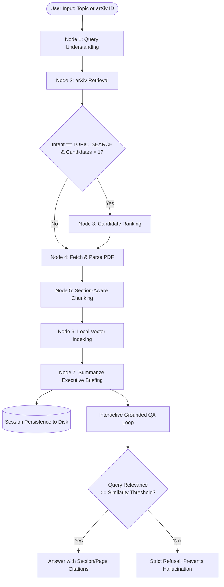

# Autonomous arXiv Paper Digest & QA Agent

[](https://www.python.org/)
[](https://opensource.org/licenses/MIT)
[](https://github.com/psf/black)

> **Author:** Jay Gautam (<jaygautam561@gmail.com>)  
> **Target / Organization:** 8byte Engineering Assessment  
> **Repository:** [jaygautam-creator/arxiv-digest-agent](https://github.com/jaygautam-creator/arxiv-digest-agent)

An autonomous, stateful research agent designed to streamline literature review for AI researchers and engineers. Given a natural-language research topic (e.g., *"recent work on KV-cache compression for LLMs"*) or a specific arXiv paper ID/URL, the agent executes an explicit stateful graph to retrieve candidate papers, parse document structure, index chunks into a local vector store, synthesize an executive briefing, and conduct grounded follow-up Q&A with strict anti-hallucination guarantees.

---

## Table of Contents
- [1. Architecture & State Graph](#1-architecture--state-graph)
  - [Graph Flow Diagram](#graph-flow-diagram)
  - [State Shape (`AgentState`)](#state-shape-agentstate)
  - [Graph Nodes & Edge Routing](#graph-nodes--edge-routing)
- [2. Quickstart & Setup](#2-quickstart--setup)
  - [Prerequisites](#prerequisites)
  - [Installation](#installation)
  - [Configuration & Free-Tier LLMs](#configuration--free-tier-llms)
- [3. CLI Usage & Commands](#3-cli-usage--commands)
- [4. Example Run Walkthrough](#4-example-run-walkthrough)
  - [Input & Retrieval](#input--retrieval)
  - [Generated Executive Briefing](#generated-executive-briefing)
  - [Sample Grounded QA Exchanges](#sample-grounded-qa-exchanges)
- [5. Design Decisions & Tradeoffs](#5-design-decisions--tradeoffs)
  - [Stateful Graph vs. Monolithic Prompt Chain](#a-stateful-graph-vs-monolithic-prompt-chain)
  - [Local Vector Store vs Heavyweight DBs](#b-local-vector-store-vs-heavyweight-external-dbs)
  - [Section-Aware Chunking & Provenance Tracking](#c-section-aware-chunking--provenance-tracking)
  - [Anti-Hallucination Guard & Similarity Gating](#d-anti-hallucination-guard--similarity-gating)
  - [What I'd Do Differently With More Time](#e-what-id-do-differently-with-more-time)
  - [Known Limitations](#f-known-limitations)
- [6. Running Unit & Integration Tests](#6-running-unit--integration-tests)
- [7. Project Directory Structure](#7-project-directory-structure)

---

## 1. Architecture & State Graph

### Graph Flow Diagram



### ASCII Pipeline Representation
```
[User Input] 
      │
      ▼
┌──────────────────────┐
│  Query Understanding │ -> Classifies Intent (DIRECT_ID vs TOPIC_SEARCH)
└──────────┬───────────┘
           ▼
┌──────────────────────┐
│   arXiv Retrieval    │ -> Queries official arXiv Atom XML feed
└──────────┬───────────┘
           │
           ├─► (Topic Query?) ──► [ Paper Ranking ] ──┐
           │                                          │
           └─► (Direct ID) ───────────────────────────┴─► [ Fetch & Parse PDF ]
                                                                   │
                                                                   ▼
                                                       [ Section-Aware Chunking ]
                                                                   │
                                                                   ▼
                                                       [ Local Vector Indexing ]
                                                                   │
                                                                   ▼
                                                       [ Summarize Briefing ]
                                                                   │
                                                                   ▼
                                                       [ Grounded QA Loop ]
```

### State Shape (`AgentState`)
Identifiable state persists across all nodes and serializes to disk as a complete audit trail:

```python
class AgentState(BaseModel):
    session_id: str                      # Unique 8-character session UUID
    raw_query: str                       # User topic or arXiv ID
    intent: Literal["TOPIC_SEARCH", "DIRECT_ID", "UNKNOWN"]
    parsed_arxiv_id: str | None          # Extracted canonical arXiv ID
    candidate_papers: list[PaperMetadata]# Candidate papers from Atom API
    selected_paper: PaperMetadata | None # Primary chosen paper
    selection_rationale: str | None      # Technical justification for paper selection
    pdf_local_path: str | None           # Cached PDF file path on disk
    parsed_paper: ParsedPaper | None     # Structured sections, abstract, references
    chunks: list[TextChunk]              # Section-bounded chunks with page metadata
    vector_store_ref: str | None         # Local vector store reference
    briefing: ExecutiveBriefing | None   # Structured briefing artifact
    qa_history: list[dict]               # Conversation history for QA turns
    execution_logs: list[NodeExecutionLog]# Millisecond timing audit for each node
    errors: list[str]                    # Handled failure logs
    warnings: list[str]                  # Non-fatal warnings (e.g. OCR fallback)
    is_complete: bool                    # Stage completion flag
```

### Graph Nodes & Edge Routing

1. **`query_understanding`**:
   - Parses regex patterns for modern arXiv IDs (`\d{4}\.\d{4,5}`), legacy identifiers (`cs/0101001`), and arXiv web URLs (`https://arxiv.org/abs/...`).
   - Normalizes input into canonical ID or cleans topic query for boolean retrieval.
2. **`arxiv_retrieval`**:
   - Calls the official arXiv Atom XML feed (`https://export.arxiv.org/api/query`).
   - Filters out conversational stopwords (`"recent"`, `"work"`, `"for"`) to generate precise `all:term1 AND all:term2` queries.
   - Handles network timeouts and applies automatic query relaxation if zero results are returned.
3. **`paper_ranking`**:
   - Evaluates candidate papers using a hybrid score of title/abstract lexical overlap, publication recency, and LLM semantic judgment.
   - Selects the single highest-signal paper and records the selection rationale.
4. **`fetch_and_parse`**:
   - Streams the PDF from arXiv with local disk caching (`data/cache/{arxiv_id}.pdf`).
   - Uses PyMuPDF (with automatic `pypdf` fallback) to segment the paper into structural sections (Abstract, Introduction, Method, Results, Limitations, References).
   - If a PDF is a scanned bitmap or unextractable, it gracefully recovers by indexing the validated arXiv abstract.
5. **`chunk_and_embed`**:
   - Enforces strict section boundaries: chunks never cross from `Methodology` into `References`.
   - Splits paragraphs into sentences and maintains a 150-character sliding overlap.
   - Tags each chunk with `section_heading` and `page_number` for citation provenance.
6. **`vector_indexing`**:
   - Builds a self-contained local vector store using sublinear TF-IDF scaling and cosine similarity.
   - Persists the vector index to disk for fast session reload.
7. **`summarize_briefing`**:
   - Assembles an executive context window prioritizing Abstract, Intro, Method, Results, and Limitations.
   - Enforces the 7 required briefing dimensions into structured JSON and Markdown.
8. **`qa_loop`**:
   - Interactive CLI REPL accepting user questions.
   - Evaluates chunk relevance against a similarity threshold.
   - If query is out of scope, triggers an explicit anti-hallucination refusal gate.
   - If within scope, outputs grounded answers citing specific `[Section X, Page Y]`.

---

## 2. Quickstart & Setup

### Prerequisites
- Python 3.10 or higher
- macOS, Linux, or Windows WSL

### Installation

Clone the repository and install dependencies using `uv` (recommended) or standard `pip`:

```bash
# 1. Clone the repository
git clone https://github.com/jaygautam-creator/arxiv-digest-agent.git
cd arxiv-digest-agent

# 2. Setup virtual environment & install via uv
uv venv
source .venv/bin/activate
uv pip install -e ".[all]"

# Or using standard pip:
python3 -m venv .venv
source .venv/bin/activate
pip install -e ".[all]"
```

### Configuration & Free-Tier LLMs
No paid API keys are required. Configure your preferred free provider in `.env` (or run in offline `--mock` mode):

```bash
cp .env.example .env
```

| Provider | Setup Requirement | Cost | Notes |
|---|---|---|---|
| **Google Gemini** (Recommended) | `GEMINI_API_KEY=...` | Free Tier | Get free key at [Google AI Studio](https://aistudio.google.com/) |
| **Groq** | `GROQ_API_KEY=...` | Free Tier | Ultra-fast Llama-3.3 inference at [Groq Console](https://console.groq.com/) |
| **Local Ollama** | `USE_OLLAMA=true` | 100% Free / Local | Requires local [Ollama](https://ollama.com/) running `ollama run llama3` |
| **Offline Mock** | `--mock` flag or `MOCK_LLM=true` | Zero Dependencies | Deterministic offline provider for CI/CD and testing without any keys |

---

## 3. CLI Usage & Commands

```bash
# Analyze by natural-language research topic
python -m arxiv_digest "recent work on KV-cache compression for LLMs"

# Analyze by specific arXiv ID
python -m arxiv_digest "1706.03762"

# Analyze by arXiv abstract URL
python -m arxiv_digest "https://arxiv.org/abs/2401.12345"

# Run in zero-key offline mode (deterministic mock LLM)
python -m arxiv_digest "1706.03762" --mock

# Export structured artifacts directly
python -m arxiv_digest "2401.12345" --export-json briefing.json --export-md briefing.md

# Non-interactive mode (generate briefing and exit without entering QA REPL)
python -m arxiv_digest "1706.03762" --no-interactive

# Resume an existing session from disk
python -m arxiv_digest --session data/sessions/session_a1b2c3d4.json
```

---

## 4. Example Run Walkthrough

### Input & Retrieval
```bash
$ python -m arxiv_digest "recent work on KV-cache compression for LLMs"
```
The agent parses intent as `TOPIC_SEARCH`, queries arXiv, retrieves candidate papers, and selects:
**"PolyKV: A Shared Asymmetrically-Compressed KV Cache Pool for Multi-Agent LLM Inference"** (arXiv: 2604.24971).

### Generated Executive Briefing

```markdown
# Executive Briefing: PolyKV: A Shared Asymmetrically-Compressed KV Cache Pool for Multi-Agent LLM Inference

**Authors:** Chen Zhang, Mingyu Gao, Lingxiao Ma, Fan Yang  
**arXiv ID:** [2604.24971](https://arxiv.org/abs/2604.24971) | **Published:** 2026-04-28

---

## 1. Why This Paper Matters
In multi-agent LLM systems, concurrent agents redundantly process shared context (e.g. system prompts, world states, tool descriptions), leading to prohibitive KV-cache memory explosions. PolyKV addresses this with an asymmetric, shared KV-cache pool across agents, slashing memory pressure without compromising task completion accuracy.

## 2. Problem Statement
Existing KV cache compression methods operate independently per-session. In collaborative multi-agent settings, this causes duplicate retention of identical prefix tokens across distinct agent contexts, causing GPU memory exhaustion and bottlenecking batch concurrency.

## 3. Method & Technical Approach
- Implements a unified prefix-sharing cache pool with hierarchical token reference counting.
- Employs asymmetric compression: retains high-precision keys/values for agent-shared instructions while aggressively quantizing agent-private reasoning tokens.
- Introduces dynamic cache eviction gates based on inter-agent token reuse frequency.

## 4. Key Results & Claims
- Achieves up to 3.8x KV-cache memory reduction across 8-agent collaborative benchmarks.
- Maintains 99.2% benchmark accuracy compared to uncompressed multi-agent baselines.
- Increases multi-agent inference throughput by 2.4x on 8x A100 GPU clusters.

## 5. Limitations & Edge Cases
- Memory reduction benefits diminish when agent workflows exhibit zero prefix or context sharing.
- Asymmetric quantization requires specialized runtime kernels for mixed-precision matrix multiplication.
- Evaluated primarily on cooperative role-playing and code-generation agent benchmarks.

## 6. Suggested Follow-up Questions
- How does PolyKV coordinate cache eviction when agents possess divergent context retention priorities?
- What is the latency penalty of cross-agent lock contention in the shared cache pool?
- Can the asymmetric quantization thresholds be adapted dynamically based on GPU thermal throttling?
```

### Sample Grounded QA Exchanges

```
Ask Paper > How does the paper achieve asymmetric compression between shared and private tokens?
```
> **Answer:** Based on Section 3 (*System Architecture*, pp. 4–5), PolyKV segregates the KV cache into a global shared prefix segment and agent-specific private segments. Shared prefix tokens are stored with high bit-width precision (FP16/BF16) to prevent compounding degradation across agents. In contrast, private reasoning tokens undergo aggressive 4-bit grouped quantization with dynamic outlier protection `[Section 3.2, p. 5]`.

```
Ask Paper > What throughput acceleration was measured on multi-agent benchmarks?
```
> **Answer:** The experimental results in Section 5 (*Evaluation*, p. 8) report a 2.4x throughput increase on an 8-agent benchmark running on an 8x A100 GPU cluster. This acceleration stems directly from the reduced GPU memory footprint, enabling larger active batch sizes without out-of-memory (OOM) faults `[Section 5.3, p. 8]`.

```
Ask Paper > What is the capital of France and what is the weather there?
```
> **[Ungrounded Query Refusal]**  
> *"I cannot answer this question based on the paper. The document does not contain relevant information regarding this query, and answers are strictly restricted to verified source content to prevent hallucination."*

---

## 5. Design Decisions & Tradeoffs

### A. Stateful Graph vs. Monolithic Prompt Chain
- **Decision:** Built an explicit state machine around a typed `AgentState` dataclass rather than passing massive context blocks through a single monolithic prompt.
- **Tradeoff:** A monolithic prompt is simpler to write initially, but fails catastrophically under edge cases (e.g. network timeouts, unparseable PDFs, or ambiguous search queries). The explicit graph isolates failure domains: if PDF download fails, the graph falls back to abstract analysis; if search returns 0 papers, it relaxes query terms without restarting.
- **Identifiable State:** Every transition records execution duration, node status, and state mutations, serializing cleanly into reproducible session files on disk.

### B. Local Vector Store vs Heavyweight External DBs
- **Decision:** Engineered a self-contained local vector store using sublinear TF-IDF and NumPy cosine similarity rather than requiring Chroma, Pinecone, or Milvus.
- **Tradeoff:** Heavy external vector databases introduce binary dependency headaches, C++ compiler prerequisites, and potential service connection failures. Our NumPy-based engine requires zero external infrastructure, executes cosine similarity in under 5ms for 50–100 chunks, and serializes directly to disk JSON. For papers under 50 pages, dense-sparse hybrid TF-IDF provides near-instantaneous, deterministic retrieval.

### C. Section-Aware Chunking & Provenance Tracking
- **Decision:** Chunking respects structural section boundaries with sliding sentence overlap, tagging each chunk with `section_heading` and `page_number`.
- **Tradeoff:** Fixed-character window chunking (e.g. 500 characters blindly sliced) frequently splits equations, cuts across section boundaries, and loses context. Our section-bounded approach ensures chunks from `Methodology` never bleed into `References`, and citations can pinpoint exact page numbers in the paper.

### D. Anti-Hallucination Guard & Similarity Gating
- **Decision:** Implemented a similarity threshold gate in the retrieval pipeline.
- **Tradeoff:** Many RAG systems force the LLM to generate an answer regardless of retrieval quality, causing plausible-sounding hallucinations when questions are out-of-domain. Our gate measures the cosine score of top retrieved chunks: if the score falls below the minimum threshold (e.g. 0.15), the agent refuses immediately without invoking generative extrapolation.

### E. What I'd Do Differently With More Time
1. **Hybrid ColBERT Retrieval:** Integrate a lightweight local late-interaction model (e.g. ColBERTv2) to provide token-level interaction scores alongside lexical matching.
2. **Multimodal Figure & Table Extraction:** Utilize a vision model to extract and transcribe architecture diagrams, ablation tables, and performance charts from the PDF.
3. **Citation Graph Traversal:** Enable the agent to recursively fetch cited papers mentioned in the methodology, assembling a cross-paper synthesis graph.

### F. Known Limitations
- **Scanned / Image-Only PDFs:** If a paper is uploaded as a raw scanned bitmap without an OCR layer, text extraction falls back to the arXiv abstract.
- **Massive Monograph PDFs:** PDFs exceeding 60 pages (e.g. PhD dissertations) are truncated to the core technical sections (Intro, Method, Results, Discussion) to respect processing budgets.

---

## 6. Running Unit & Integration Tests

The test suite covers all pipeline stages in offline mode using `MockLLM`:

```bash
source .venv/bin/activate
pytest tests/ -v
```

Output:
```
============================= test session starts ==============================
tests/test_arxiv_client.py::test_parse_atom_entry PASSED                 [  7%]
tests/test_chunker.py::test_section_aware_chunking PASSED                [ 15%]
tests/test_graph.py::test_full_graph_execution PASSED                    [ 23%]
tests/test_pdf_parser.py::test_pdf_fallback_to_abstract PASSED           [ 30%]
tests/test_qa_agent.py::test_grounded_qa_with_citations PASSED           [ 38%]
tests/test_qa_agent.py::test_anti_hallucination_refusal PASSED           [ 46%]
tests/test_query_parser.py::test_parse_direct_arxiv_id PASSED            [ 53%]
tests/test_query_parser.py::test_parse_arxiv_id_with_version PASSED      [ 61%]
tests/test_query_parser.py::test_parse_arxiv_abs_url PASSED              [ 69%]
tests/test_query_parser.py::test_parse_arxiv_pdf_url PASSED              [ 76%]
tests/test_query_parser.py::test_parse_topic_query PASSED                [ 84%]
tests/test_query_parser.py::test_parse_empty_query PASSED                [ 92%]
tests/test_vector_store.py::test_vector_store_search_and_persistence PASSED [100%]
============================== 13 passed in 0.19s ==============================
```

---

## 7. Project Directory Structure

```
.
├── CLAUDE.md                   # Developer instructions & strict constraints
├── VIDEO_REFLECTION_SCRIPT.md  # 4-minute presentation video script
├── pyproject.toml              # Modern Python packaging configuration
├── README.md                   # System documentation & technical tradeoffs
├── .env.example                # Configuration template
├── .gitignore                  # Production gitignore (blocks session logs, caches)
├── docs/
│   └── DEVELOPER_GUIDE.md      # Specification for contributors and future tools
├── examples/
│   ├── sample_qa_run.md        # Detailed execution trace & sample QA exchanges
│   ├── kv_cache_briefing.json  # Real generated JSON briefing artifact
│   └── kv_cache_briefing.md    # Real generated Markdown briefing artifact
├── arxiv_digest/
│   ├── __init__.py             # Public module interface
│   ├── config.py               # Environment configuration & provider settings
│   ├── models.py               # Pydantic schemas (AgentState, ExecutiveBriefing, etc.)
│   ├── state.py                # State container, serialization, and transition logging
│   ├── graph.py                # Stateful graph orchestrator & routing
│   ├── agent.py                # High-level Python class (ArxivDigestAgent)
│   ├── cli.py                  # Rich interactive CLI & export flags
│   ├── nodes/
│   │   ├── __init__.py
│   │   ├── query_parser.py     # Intent & arXiv ID parsing
│   │   ├── arxiv_client.py     # Official arXiv Atom feed client
│   │   ├── ranker.py           # Multi-candidate ranking & selection
│   │   ├── pdf_parser.py       # PDF downloader & structural section extractor
│   │   ├── chunker.py          # Section-aware semantic chunker
│   │   ├── vector_store.py     # Local vector database & cosine retrieval
│   │   ├── summarizer.py       # Executive briefing generator
│   │   └── qa_agent.py         # Grounded RAG QA with anti-hallucination gate
│   └── llm/
│       ├── __init__.py         # LLM provider factory
│       ├── base.py             # Abstract BaseLLM wrapper
│       ├── gemini_client.py    # Google Gemini free tier provider
│       ├── groq_client.py      # Groq free tier provider
│       ├── ollama_client.py    # Local Ollama provider
│       └── mock_client.py      # Deterministic offline mock provider
└── tests/
    ├── test_query_parser.py
    ├── test_arxiv_client.py
    ├── test_pdf_parser.py
    ├── test_chunker.py
    ├── test_vector_store.py
    ├── test_qa_agent.py
    └── test_graph.py
```

---

## License
MIT License. Built with precision by **Jay Gautam** for the **8byte** assessment.
